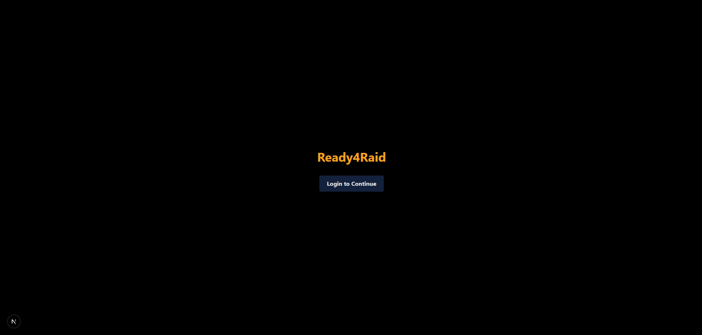
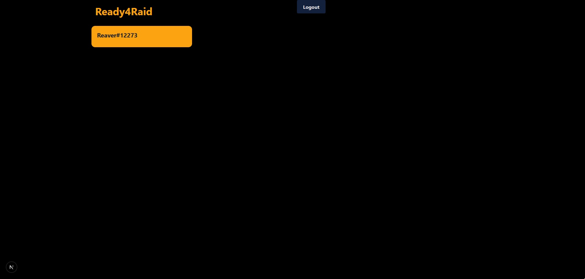

## Ready4Raid

This app aims to allow a player to check how ready one of there characters is by assesing the Ilvl of players gear compared to the raid they want to enter.

Built using Next.Js 16.1.2

### Development

## Week One

Implementation of basic components complete, and basic login screen built.

Authentication using Auth.js (Next-Auth) completed, and confirmed returned session token, basic landing page built confirming logged in users username.

# Next Steps

Implemntation of API calls to access player gear and current raiding tiers.

# Possible difficulties

Managing multiple API calls to different endpoints to access the required information could have unforseen issues with state handling or too many requests.
