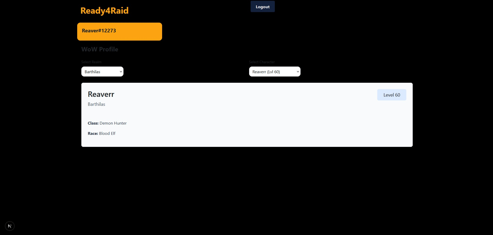
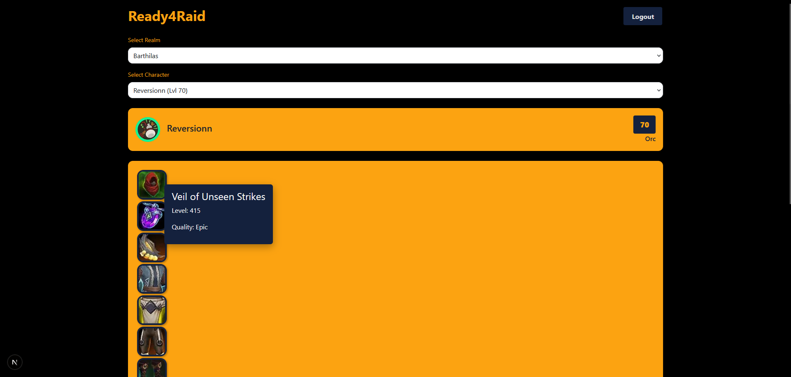
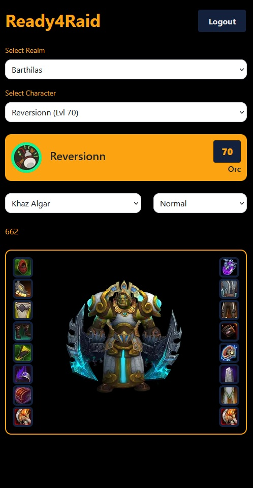
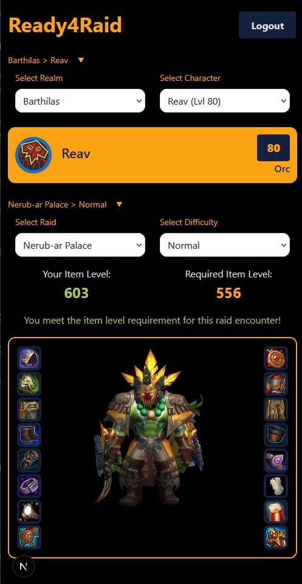
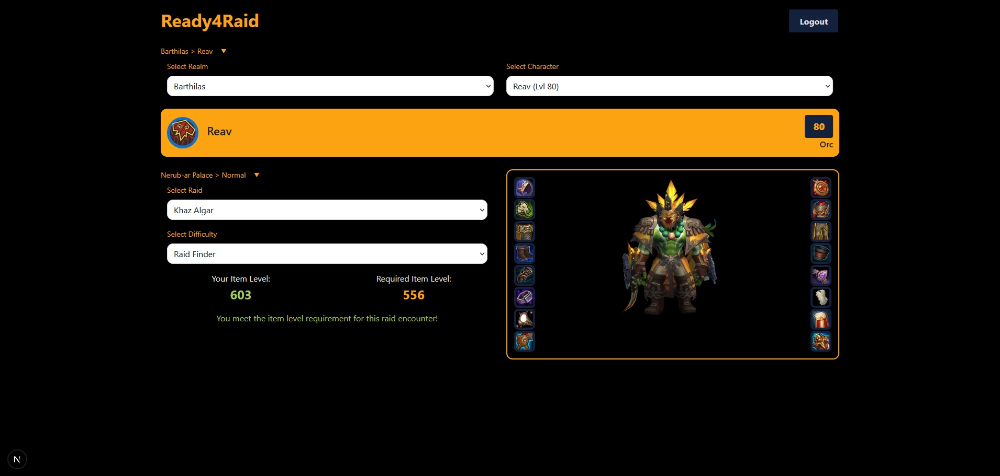

# Ready4Raid

This app aims to allow a player to check how ready one of there characters is by assesing the Ilvl of players gear compared to the raid they want to enter.

Built using Next.Js 16.1.2

## Local usage

To run this app locally you will need

- Node.js (includes npm) – version 18+ recommended for Next.js 15+

Clone the repo and install the required packages with

```
npm i
```

Build the application then run it with

```
npm run build
npm run start
```

## Development

### Week One

Implementation of basic components complete, and basic login screen built.


Authentication using Auth.js (Next-Auth) completed, and confirmed returned session token, basic landing page built confirming logged in users username.


#### Next Steps

Implemntation of API calls to access player gear and current raiding tiers.

#### Possible difficulties

Managing multiple API calls to different endpoints to access the required information could have unforseen issues with state handling or too many requests.

### Week Two

Creation of API call to access Wow Profiles and implementation of dropdown component to Pick between Realms and Characters.



#### Encountered Issues

Understanding of how Auth js handled the returned information was inccorect and required additonal fields such as JWT for access token encryption, as well as aditional scope fields to allow access to certain parts of the WoW API such as profile information.

#### Next Steps

Fetching of additonal information for selected characters such as item Level, Clean up of character panel component to use react-bootstrap to be in line with the rest of the project, clean up of types using a global types file now that there is a better understanding of the types used.

#### Possible difficulties

The handling of multiple API returns and passing information through multiple components could exponentially increase the complexity of this project.

## Week Three

Implementation of API calls for character equipment and further call for individual equipment Icons, added hover box for item information



Added API Calls for current expansion, raid tiers, and difficulties, cleaned up front end, added the new Loading Wheel component to most functional components, added further options, and displaying the item level of gear dropped by this raid, switched to mobile development.



#### Encountered Issues

Some fetch requests like in the IlvlChecker appear to be sending twice, need further investigation into how to solve, A lot of handeling of Loading And Error States across multiple components, also need futher investigation into possible solutions.

## Next Steps

Adding in the logic to decide what the approriate item level would be for your character to attempt the selected raid, further front end cleanup and animations.

#### Possible difficulties

Most of the difficult parts seem to be behind me now, figuring out how to clean up some of the states and repeat fetch requests could cause issues.

## Week Four

Reworked the way fetch calls are made by creating a useAPI hook that can manage its own states for error and loading to clean up states used anywhere a fetch call was made, this hook is then used by another hook for calling each individual endpoint.

Finished Calculation of Player Ilvl vs Raid Ilvl by getting the average of the players equipped gear, and comparing it to the most reoccuring Ilvl of the gear dropped by the first encounter of that raid.


Created CollapseDropdown component to reduce screen space of dropdowns once the conditions for them are met, and a hook to manage those conditions, and a re trigger of the collapse whenever the second condition changes,


Re shuffle of component layout for responsive design across mobile and desktop




